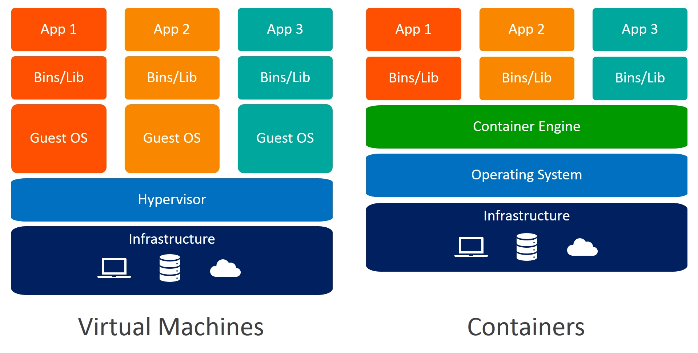
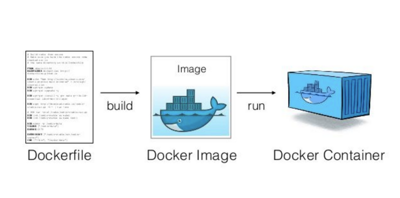
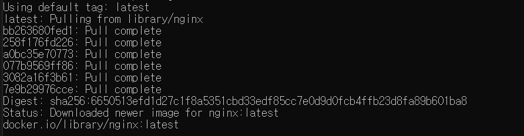

# Docker

## What is Docker

✔ Tool for Running Applications in an isolated environment

✔ App runs in the save environment

✔ Standard for software deployment

### Container vs VM



#### Container 

✔ Abstraction at the app layer that packages code and dependencies together

✔ Multiple containers can run on the same machine and share the OS kernel while each running as isolated processes

✔ Light & Fast

#### Virtual Machines

✔ Abratction of physical hardware turning one server into many servers

✔ Each VM includes a full copy of an operating system

✔ Heavy & Slow

## Docker Image

✔ Template for creating an environment of your application

✔ Snapshot
- able to go back to a specific version

✔ Contains everything the app requires to run (OS, software, code...)

### Container



✔ Running instance of an image

### 예시: Nginx image 띄우기

```shell
docker pull nginx
```



