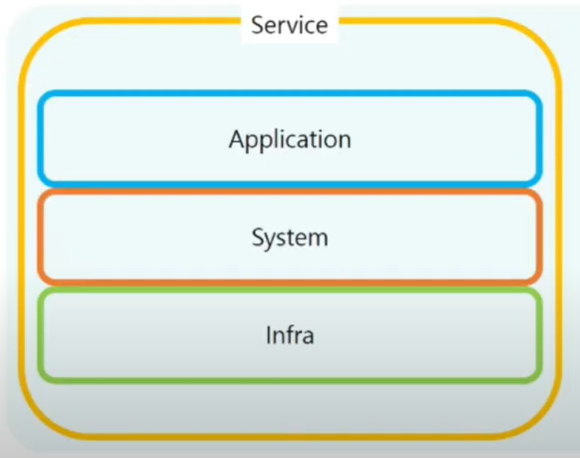

# Dev -Ops: Infra

## System

✔ 복수의 요소로 구성되고, 이 둘이 서로 유기적 관련을 갖고 겨랗ㅂ하여 전체로서 목적을 달성해야 하며 특정한 기능을 완수하도록 수겅된 여러 요소의 결합체

✔ 각 구성요소들이 상호작용하거나 상호의존하여 복잡하게 얽힌 통일된 하나의 집합체

✔ **무엇인가 하기 위해 구성한 체계**  
✔ **목적에 맞춰서 만든 체계**

## Infra

✔ (특정한 App을 활용하여 서비스를 운영하기 위해) 필요한 다양한 하드웨어나 운영체제, 미들웨어, 네트워크 등 시스템의 가반을 총칭

✔ IT인프라 = **시스템들의 기반 체계**
- 하드웨어
- 운영체제
- 네트워크
- 미들웨어

### [참고] 미들웨어

✔ 서로 다른 애플리케이션이 서로 통신하는 데 사용되는 소프트웨어
- 데이터관리
- 메시징
- 인증 및 API
- ...

## 시스템과 인프라

