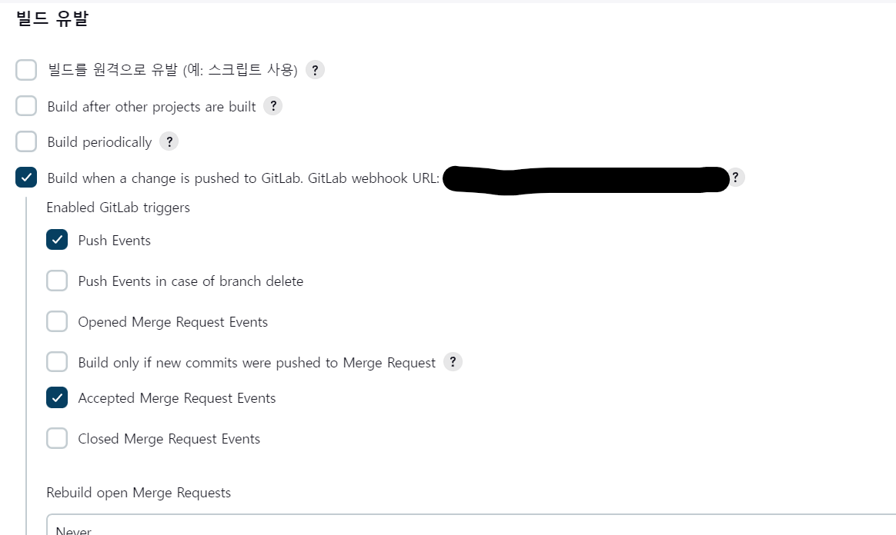
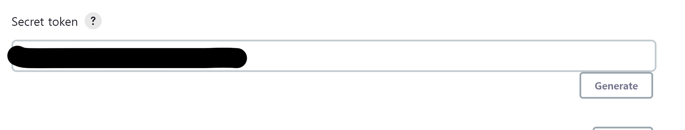
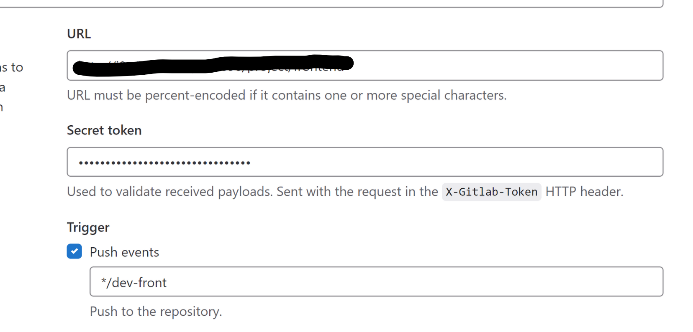
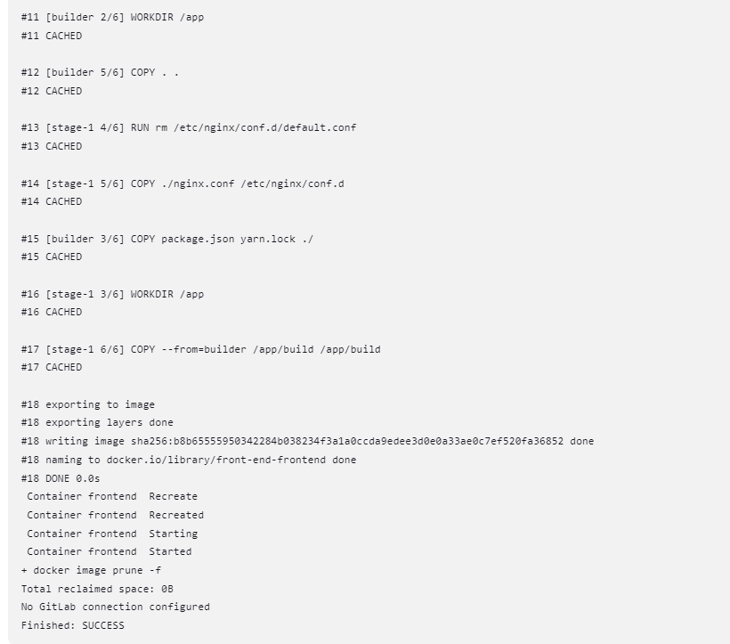
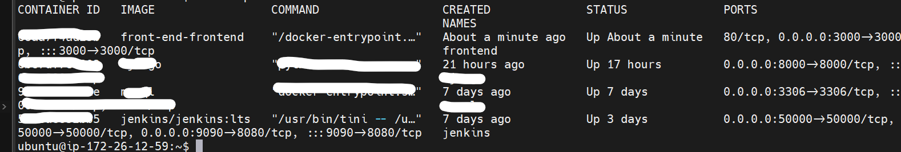

# jenkins와 gitlab 연결해주기

## 1. 젠킨스 설치

먼저 다음 글을 참고해서 도커인 도커가 적용된 젠킨스를 ec2 서버 내부에 설치해주자 

[Docker in Docker를 적용한 Jenkins 설치하기
](https://bluuubery.tistory.com/178)

✔ 왜 도커를 통해 설치한 젠킨스에 또 도커를 설치할까?
- 먼저 도커를 사용해 젠킨스를 image&conatainer화 해서 ec2 서버에 설치해둔다. 
- 설치된 젠킨스는 연결된 프로젝트(본 글에서는 frontend)에 대한 ci/cd를 맡게 되는데, 빌드/배포하는 과정에서 도커를 사용해 컨테이너화 하기 때문에 젠킨스 내부에도 도커가 필요하게 되는 것이다.

## 2. 젠킨스 프로젝트 생성

1번 블로그 링크를 참고해 도커를 설치했다면 깃랩과 도커 플러그인이 잘 설치되었을 것이다. 

만약 설치가 안되었다면 DashBoard > Manager Jenkins > Plugin Manager에서 gitlab, docker 검색 후 각각 상위 4개 항목을 설치해주자

본격적인 프로젝트 생성 과정은 다음과 같다.

✔ Jenkins 메인 화면에서 새로운 item을 눌러 프로젝트를 생성해주자

✔ 프로젝트는 프리스타일로 생성했다.

> Q. 왜 파이프라인이 아니라 프리스타일로 했나요?
> A. Jenkins의 파이프라인 기능을 활용하면 빌드 배포 테스트 등의 기능을 단계별로 실행할 수 있습니다. 추가로 파이프라인 스크립트를 jenkinsfile로 빼네 버전 관리를 할 수 있다는 장점이 있어 복잡하거나 대규모 작업에 용이합니다. 본 프로젝트 같은 경우에는 굳이 해당 기능들이 필요하지 않아서 비교적 간편한 프리스타일로 진행했습니다.

## 3. 젠킨스 -> 깃랩 연결

✔ 소스코드 관리에서 git을 선택해주고 연결할 레포지토리 주소를 입력해준다.

✔ Credential 같은 경우에 ssh키나 api토큰을 이용하는 등 여러가지 방법이 있는데 본 글에서는 비교적 단순한 방식인 깃랩 계정을 통해 인증을 했다.



✔ 빌드 유발 > Build when a change is pushed to Gitlab을 선택하고 생성된 웹훅 url을 잘 기억해두자



✔ 고급을 눌러보면 Secret token란이 있다. generate눌러서 토큰을 생성해주고 잘 기억해두자. 위에 생성된 웹훅 url과 함께 깃랩에서 설정할 때 사용된다

## 4. 젠킨스 쉘 스크립트 작성

✔ Build Steps > Execute shell 선택

✔ 프로젝트 루트 폴더로 이동 후 dockerfile을 실행하는 쉘 스크립트를 작성해주면 된다.

```shell
cd front-end

# 최신 이미지 빌드하고 기존 컨테이너 덮어쓰기
docker-compose up -d --build --force-recreate

# 기존 이미지 죽이기
docker image prune -f
```

✔ 우리는 직전 글에서 docker-compse로 Docekrfile의 실행환경을 정의해뒀기 때문에 해당 `docker-compose.yml` 파일을 실행해주면 된다.


```shell
# 참고: docker-compose를 쓰지 않는 경우

# 프로젝트 루트로 이동이 필요한 경우
cd ${PROJECT_ROOT}
# 기존에 돌아가는 컨테이너 죽이기
if docker ps -a --filter "name=${CONTAINER_NAME}" > /dev/null; then
  docker kill frontend && docker rm frontend
fi
docker build -t ${CONTAINER_NAME} .
docker run -d -p 포트번호:포트번호 ${CONTAINER_NAME} --name ${CONTAINER_NAME}

# 기존 이미지 죽이기
docker image prune -f
```

✔ docker-compose를 쓰지 않는 경우에는 다음과 같은 shell-script를 입력해주면 된다.

여기까지 했으면 jenkins에서의 설정은 끝났다.

## 5. 깃랩 -> 젠킨스 연결

✔ 배포할 프로젝트가 있는 gitlab 레포지토리에 들어가서 좌측하단 settings > Webhooks에 들어가자
- 만약 settings가 보이지 않는다면 멤버 권한 설정을 확인해주자



✔ \#3 에서 얻은 webhook URL과 secret token을 입력해주고 브랜치를 설정해주자

✔ 프로젝트에 맞는 Trigger 설정 후 Add webhook 클릭하자

✔ 하단의 project hooks에서 원하는 trigger를 유발해 테스트 해보자 200이 보내지면 성공이다.

## 6. 성공!



✔ 웹훅 설정을 완료하고 테스트를 보내거나 트리거를 걸어둔 이벤트를 보내면 젠킨스에서 이를 인식하고 빌드를 진행한다.

✔ 콘솔 아웃풋을 확인하면 우리가 적어둔 도커파일의 각 단계가 실행되는 것을 확인할 수 있다.



✔ ec2 서버에서도 `docker ps`를 통해 정상적으로 작동중인 것을 확인할 수 있다.


