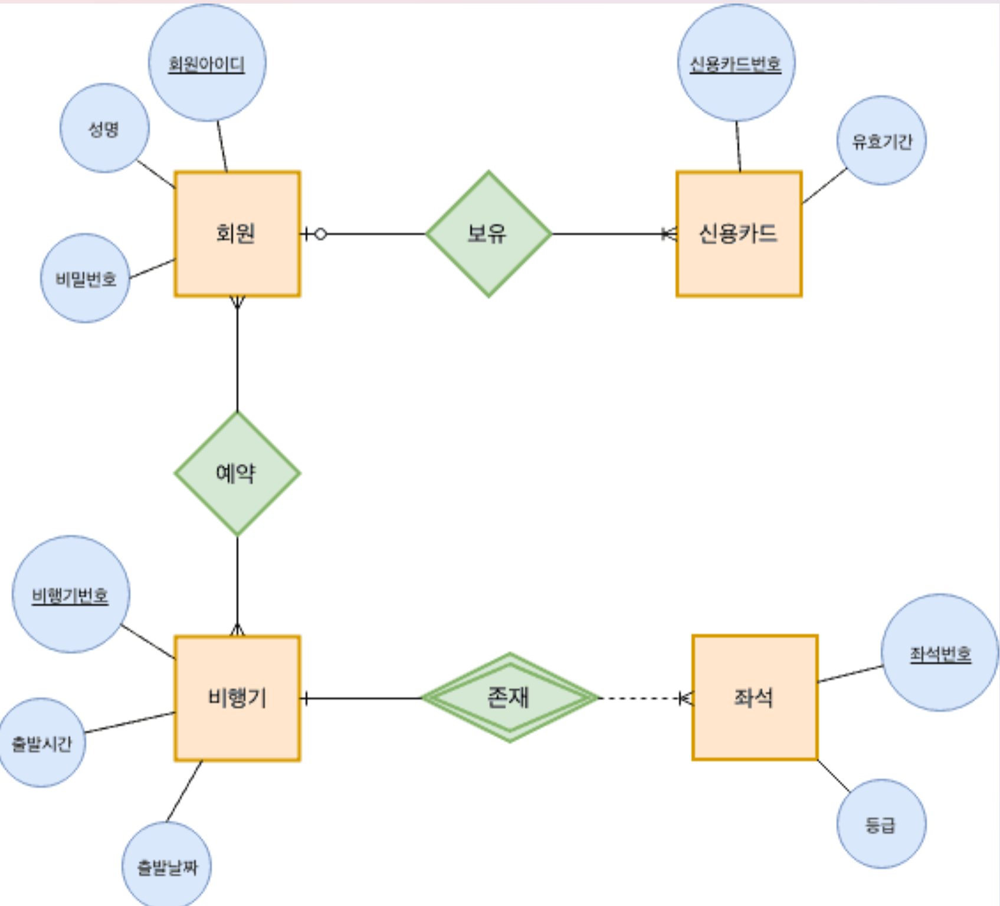
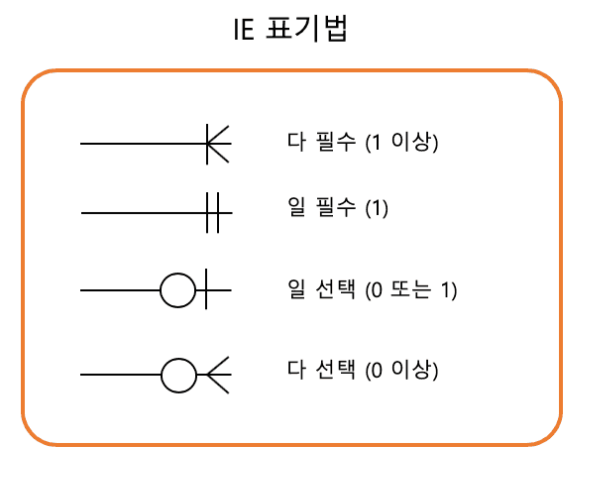
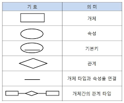
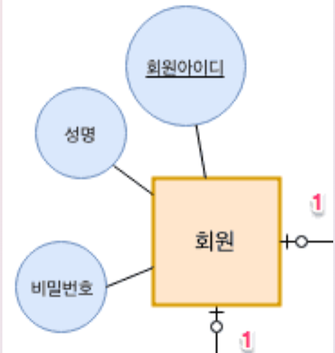
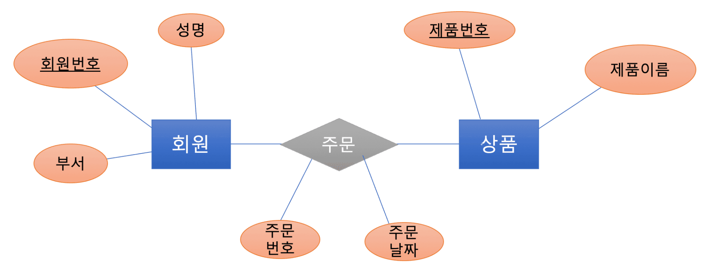
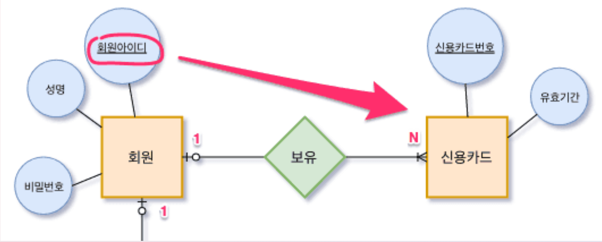
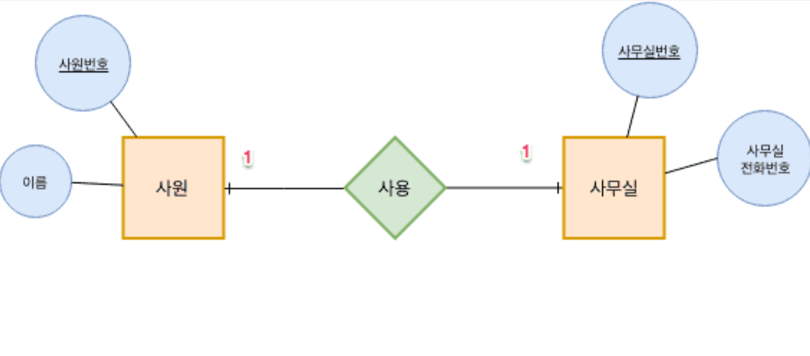
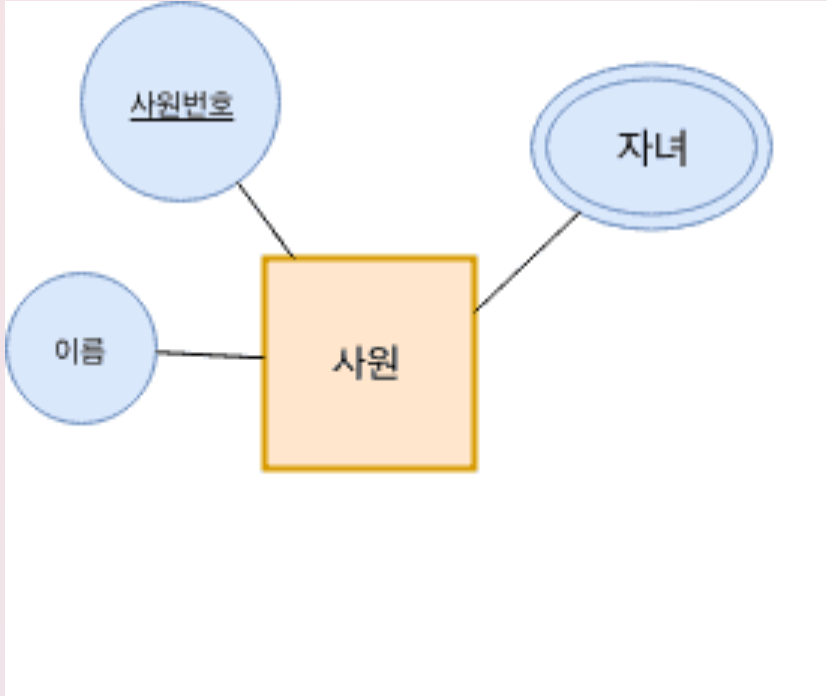

# Project DB 설계

## 1. DB 설계의 목적

✔ 프로젝트, 명세서 등의 정보 요구사항에 대한 정확한 이해

✔ 분석자, 개발자, 사용자 간의 원할한 의사 소통 수단

✔ 데이터 중심의 분석 방법

✔ 현행 시스템만이 아닌 신규 시스템 개발의 기초 제공

✔ **설계를 대충하면 기능이 추가될 때마다 DB와 관련된 이미 개발된 프로그램도 함께 뜯어고쳐야하는 경우 발생!!**

## 2. 설계를 위한 요구 사항 분석

✔ 데이터 베이스에 대한 사용자의 요구 사항을 수집하고 분석해서 아래와 같은 요구사항 (기능) 명세서 작성

### 예시: 요구사항 명세 샘플: 항공사 DB

회원으로 가입하려면 아이디, 비밀번호, 성명, 신용카드 정보를 입력해야 한다.  
회원의 신용카드 정보는 여러 개를 저장할 수 있다.  
신용카드 번호, 유효기간을 저장할 수 있다  
회사가 보유한 비행기에 대해 비행기 번호, 출발날짜, 출발시간 정보를 저장하고 있다.  
비행기 좌석에 대한 좌석 번호, 등급 정보를 저장하고 있다.  
회원은 좌석을 예약하는데, 회원 한 명은 좌석을 하나만 예약할 수 있고, 한 좌석은 회원 한 명만 예약할 수 있다.

## 3. 개념적 설계

✔ **작성한 요구 사항 명세서에서 데이터베이스를 구성하는데 필요한 개체, 속성, 개체 간의 관계를 추출하여 ERD 생성**

1. **개체(Entity)와** **속성(Attribute)** 추출
   - 대부분 명사로 선별
  
2. 개체 간의 **관계(Realtionship)** 추출
   - 대부분 동사로 선별 (개체 간의 관계를 나타내는 동사)
   - 관계에 속한 속성
   - 1:1, 1:N, N:M
   - 필수적인 참여, 선택적인 참여

### 3.1 개체와 속성 추출

✔ 요구사항에서 개체(Entity)는 대부분 명사로 이루어져 있지만, 속성(Attribute)와 구별하여 추출

**회원**으로 가입하려면 *아이디, 비밀번호, 성명*, **신용카드** 정보를 입력해야 한다.  
회원의 **신용카드** 정보는 여러 개를 저장할 수 있다.  
**신용카드** *번호, 유효기간*을 저장할 수 있다  
회사가 보유한 **비행기**에 대해 *비행기 번호, 출발날짜, 출발시간* 정보를 저장하고 있다.  
**비행기 좌석**에 대한 *좌석 번호, 등급* 정보를 저장하고 있다.  
**회원**은 **좌석**을 예약하는데, **회원** 한 명은 **좌석**을 하나만 예약할 수 있고, 한 **좌석**은 회원 한 명만 예약할 수 있다.

### 3.2 개체 간의 관계(Relationship)  추출

✔ 개체 간의 관계(Relationship)은 여려가지로 분류해서 정의된다.

회원으로 가입하려면 아이디, 비밀번호, 성명, 신용카드 정보를 입력해야 한다.  
회원의 신용카드 정보는 **여러 개를 저장**할 수 있다.  
신용카드 번호, 유효기간을 저장할 수 있다  
회사가 보유한 비행기에 대해 비행기 번호, 출발날짜, 출발시간 정보를 저장하고 있다.  
비행기 좌석에 대한 좌석 번호, 등급 정보를 저장하고 있다.  
회원은 좌석을 예약하는데, **회원 한 명은 좌석을 하나만 예약**할 수 있고, **한 좌석은 회원 한 명만 예약**할 수 있다.

### 3.3 개념 설계 기반으로 ERD 생성

#### [참고] ERD 표준 기호

## 4. 논리적 설계

✔ 모든 개체는 릴레이션(Table)로 변환

✔ N:M관계는 릴레이션(Table)로 변환

✔ 1:N 관계는 외래키로 표현

✔ 1:1 관게는 외래키로 표현

✔ 다중 속성 값은 독립 릴레이션(Table)로 변환

### 4.1 모든 개체는 릴레이션 Table로 변환

### 4.2 N:M관계는 릴레이션(Table)로 변환

### 4.3 1:N 관계는 외래키로 표현

### 4.4 1:1 관게는 외래키로 표현

### 4.5 다중 속성 값은 독립 릴레이션(Table)로 변환

## 5. 물리적 스키마 구현

✔ ERD를 실제 테이블로 생성
   - WorkBench 같은 DB Tool이나 SQL 스크립트 사용