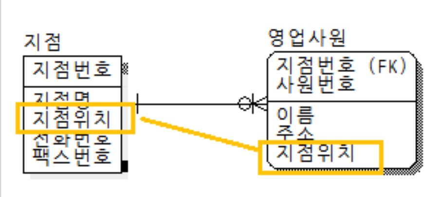
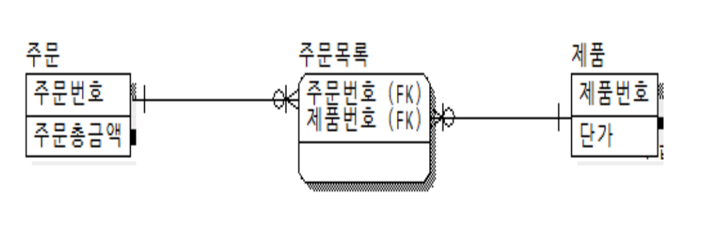
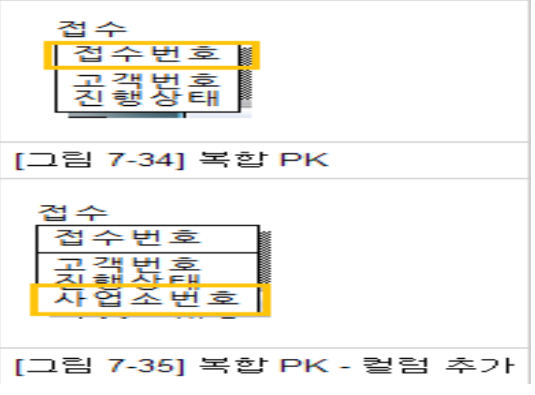
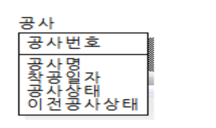
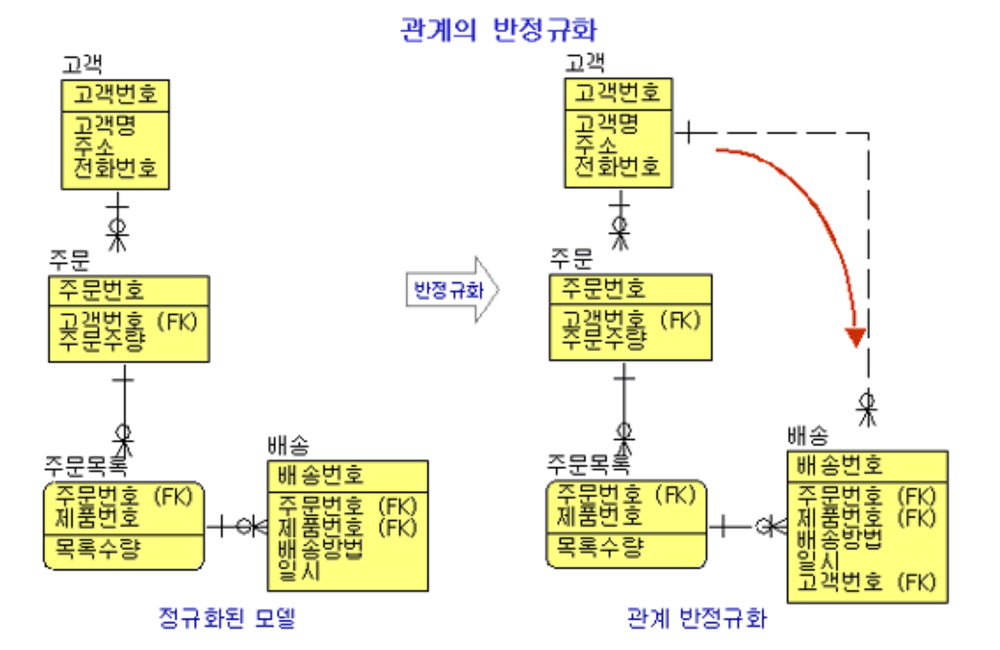

## DB 정규화

## 2. 반정규화(역정규화)란?

✔ 정규화된 엔티티타입, 속성, 관계를 시스템의 성능향상, 개발과 운영의 단순화를 위해 모델을 통합하는 프로세스

### 정규화 모델

이상적인 논리 모델은 모든 엔티티타입, 속성 관계가 반드시 한 개만 존재하며, 따라서 입력, 수정 , 삭제도 한 군대에서만 발생하므로 데이타 값이 변질되거나 이질화될 가능성이 없다. 

반면 여러 테이블이 생성되어야 하므로 **SQL작성이 용이하지 않고 과다한 테이블 조인이 발생하여 성능이 저하될 가능성이 높다.**

### 반정규화 모델

반대로 반정규화를 하면 여러 개의 테이블이 단순해지므로 SQLK 작성이 용이하고 성능이 향상될 가능성이 많다.

**그러나 같은 데이터가 여러 테이블에 걸쳐 존재하므로 무결성이 깨질 우려가 있다.**

✔ 과부하가 발생하는 정확한 기준은 없다! -> 수시로 모니터링하면서 확인

## 3. 테이블 반정규화 방법

✔ 1:1 관계의 테이블 병합

✔ 1:N 관계의 테이블 병합

✔ 수퍼/서브 타입 테이블 병합

✔ 수직 분할(집중화된 일부 칼럼을 분리)
 - 같은 테이블인데 양이 너무 많은 경우 등

✔ 수평 분할(행으로 구분하여 구간별 분리)

✔ 테이블 추가(중복테이블, 통계테이블, 이력테이블, 부분테이블)

## 4. 대표적 반정규화 - 칼럼 반정규화

✔ 중복칼럼 추가(자주 조회하는 칼럼이 있는 경우)

✔ 파생 컬럼 추가(미리 계산한 값)

✔ PK에 의한 컬럼 추가

✔ 응용 시스템 오작동을 위한 컬럼 추가(이전 데이터 임시보관)

## 5. 대표적 반정규화 - 관계 반정규화

✔ 중복 관계 추가(이미 A테이블에서 C테이블의 정보를 읽을 수 있는 관계가 임음에도 관계를 중복하여 조회(READ) 경로를 단축)

- 화면 구성을 고려하자

## 6. 요약

반정규화? 정규화?

✔ **정답은 없다: 개념을 잘 알고 있어야 상황에 따라 적절하게 쓸 수 있다!**