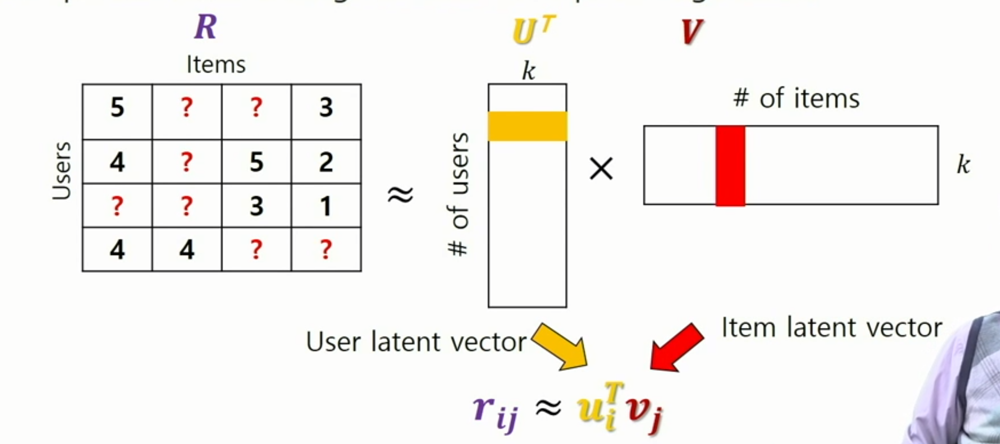
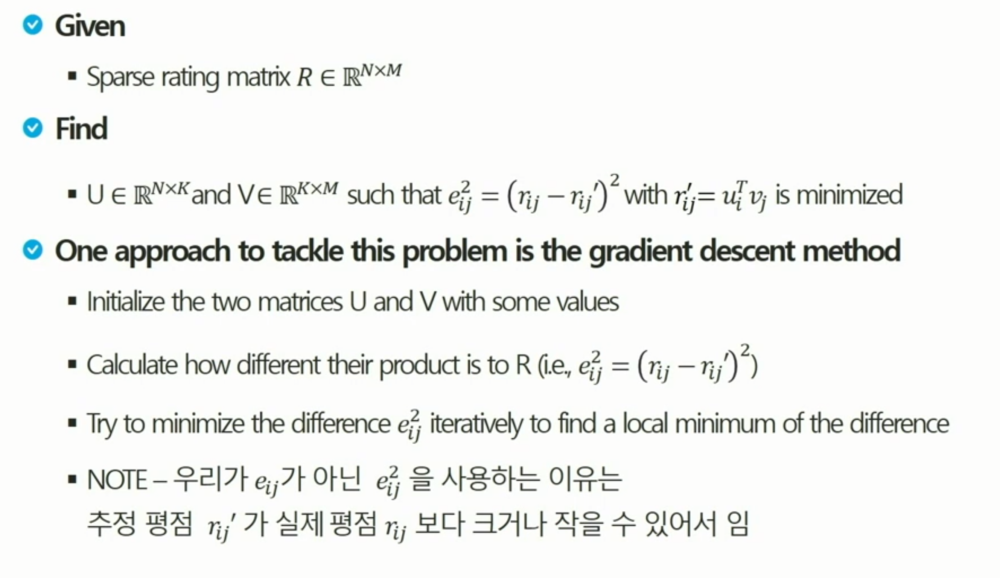
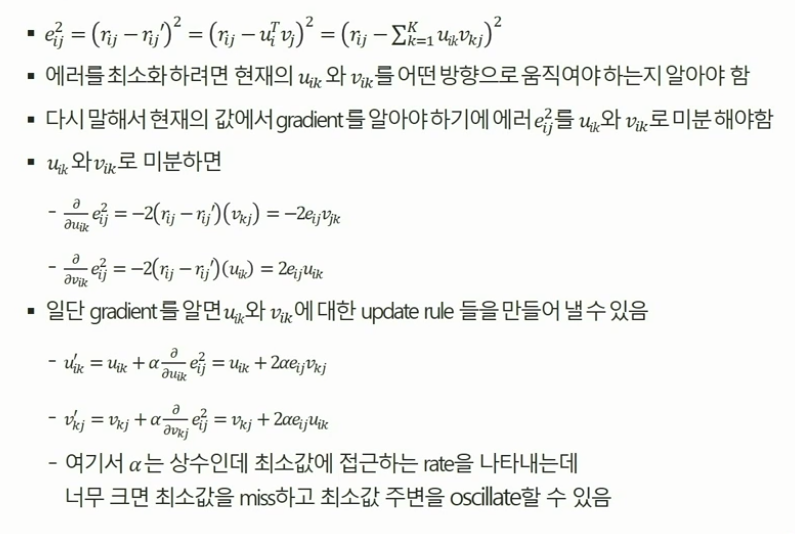
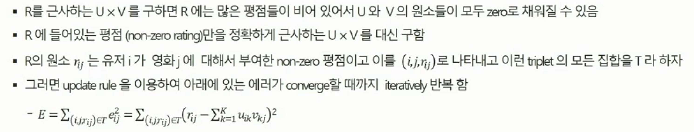
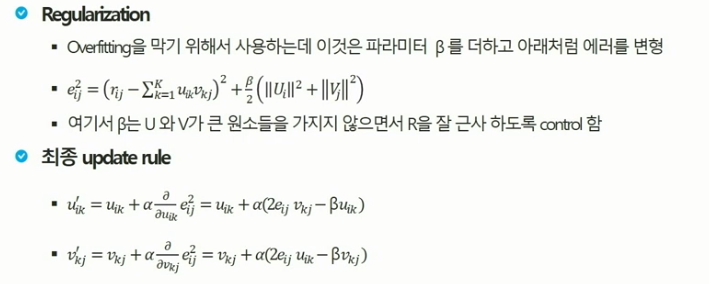

# Matrix Factorization

## 개요

✔ 추천 시스템 구현을 위한 알고리즘 중 하나

✔ 모델 기반 협업 필터링 방식

✔ U와 V벡터의 내적으로 R 행렬 채워 넣기

## Problem Definition

### 선언 및 초기화

### Gradient Descent Method

✔ 평점을 준 값들만 이용 -> non-zero 원소 이용

### Regularization

