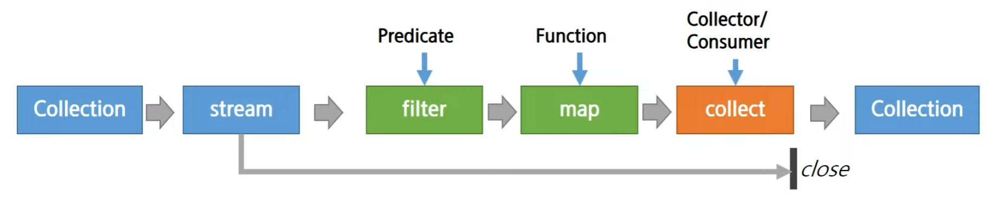
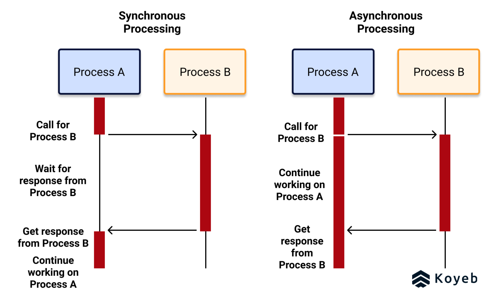

# 모던 Java with Python

# 모던 Java

## 모던 자바의 특징

✔ **함수형 패러다임** 도입

✔ **쉬운 동시성(병렬처리)** 도입

✔ 모듈성 강화

✔ 개발자 편의 API 추가

### ex

✔ **반복문 / 조건문 없이** 문자열 리스트에서 길이가 5~10인 것만 대문자로 출력하기

```java
list.stream()(filter(s -> s.length() >= 5 &&& s.length() <= 10))
    .map(s -> s.toUpperCase()).forEach(System.out::println);
```

```python
[s.upper() for s in str_lst if len(s) in range(5, 11)]
```

## 함수형

✔ **함수를 일급 시민(First Class Citizen)에 포함**
- 자바는 객체 지향 기반이 탄탄해서 완전한 함수형 패러다임은 x

✔ 익명 클래스의 번거로움을 **람다**로 간편하게, **메서드 참조**로 재사용

✔ 코드 블럭을 주입(동작 파라미터화)하고 조합(Pipeline)할 수 있게 됨

✔ 스트림의 기반, 병렬처리와 조화

✔ 주요 패키지, 클래스

- `@FunctionalInterface`
- `java.util.function`
- `Operator`
- `Consumer, Suuplier, Function, Predicate`

## 람다, 메서드 참조

✔ 람다(lambda) = **익명함수**

✔ 함수형 인터페이스(이름있는 람다): 하나의 추상 메서드를 가진 인터페이스

✔ 메서드 참조: 메서드나 생성자를 참조하기(::)

### 예시 (문자열 리스트를 길이에 따라 정렬)

```Java
Collections.sort(words, (o1, o2) -> Integer.compare(o1.length(), o2.length()));
```

```Java
Collections.sort(words, Comparator.comparingInt(String::length));
```

```Java
// java 9 버전 이후
words.sort(Comparator.comparingIng(String::length));
```

## 스트림

✔ **컬렉션** + 함수형, 데이터 처리 연산을 지원하도록 소스에서 추출된 연속된 요소
- 외부순환 vs **내부순환**
- SQL처럼 **선언형** 스타일로 데이터 처리
- 쉽게 **병렬처리** 적용: parallelStream

✔ 주요 패키지, 클래스, 메서드
- `java.util.stream`
- `map(), filter(), reduce(), min()`
- `C.stream(), C.parallelStream()`
- `BaseStream, Stream`

### 주요 개념



✔ 중간연산과 최종연산
- 중간 연산(filter, map)은 스트림을 반환, 여러 연산을 조합할 수 있다
- 최종 연산(collect)은 스트림을 모두 소비하고 닫음
- **스트림은 1회용(최종 연산 이후 사용 불가)**
    - 스코프를 최대한 짧게 쓰고 끝!

✔ 스트림 중간에 collection 가급적이면 내부 값 변경하지 않기

### 예제

✔ 직원 리스트 -> 부서별 직원 리스트

```java
Map<Department, List<Employee>> byDept = employees.stream()
        .collect(Collectors.groupingBy(Employee::getDepartment));
```
✔ 직원 리스트 -> 부서별 급여 합계

```java
Map<Department, Integer> totalByDept = employees.stream().collect(Collectors.groupingBy(Employee::getDepartment, Collectors.summingInt(Employee::getSalary)));
```

✔ 좋은 직원, 안 좋은 직원 나누기

```java
Map<Boolean, List<Employee>> byGood = employees.stream().collect(Collectors.partitioningBy(Employee::isGood));
```

---

## 파이썬

✔ 파이썬은 1버전부터 함수형

✔ 내장 컬렉션 = 리스트, 맵(딕셔너리), 튜플, 세트

✔ lambda, itertools, functools, generator

✔ **List comprehension**

## 병렬/동시성 (concurrent)

✔ 저수준 병렬 처리의 어려움: Thread, Lock, synchronized...

✔ 안전하고 쉬운 병럴처리 방법 제공 (만능은 아니다!)
- 많이 사용되는 패턴들을 언어 차원에서 API로 지원  
- 고수준, 추상화, Thread Safedty, 비동기 지원

✔ 주요 패키지, 클래스
- `java.util.concurrent`
- `Executor(s), ExecutorService`
- `xxThreadPool, ForkJoinPool`
- `Runnable, Callable`

### Executor / Service / Etc

✔ Thread를 직접 생성, 관리하지 않고, `ExecutorService`에서 스레드 관리

✔ 작업(Runnable, Callable)을 Executor 서비스에 요청하고 결과 받기

✔ 작업 스케줄링 기능

✔ Concurrent Collection
- Thread safe list/map 제공

✔ Atomic Variable

✔ lock 객체
- 동기화 패턴에 따라 사용할 수 있는 유틸리티

## 비동기 지원 (Async)



✔ 동기 vs 비동기 / 블록(block) vs 논블록(non-block)

✔ `Future`: 비동기 연산 지원, 완료 확인/대기/결과조회/취소

✔ `CompletableFuture`: Future 작업 연결, 순서 정의 등

### ex(Spring)

✔ 하나에 3초 걸리는 API 5개 호출

✔ 병럴, 비동기 x
```java
api1.callApi(param)
api2.callApi(param)
api3.callApi(param)
api4.callApi(param)
api5.callApi(param)
```

✔ 병렬, 비동기 o

```java
for (ApiService api : apis) {
    apiResults.add(api.callApi(param));
}

for (CompletableFuture<Void> future : apiResult) {
    future.get();
}
```

```java
@Async
public CompletableFuture<Void> callApi(String param) {
    // api를 호출
    return new CompletableFuture<>();
}
```

## Multiprocessing in Python

✔ GIL (Global Interpreter Lock): thread 활용을 제한하는 요소
- 점점 개선중

✔ **multiprocessing**
- 프로세스를 통한 병렬처리
  
✔ asyncio, coroutine

✔ future, executors, ThreadPoolExecutor

```python
with futures.ThreadPoolExecutor(max_workers=4) as executor:
    future_list = []
    for paramm in sorted(param_list):
        future = executor.submit(single_function, paramm)
        future_list.append(future)
    results = []
for future in futures.as_completed(future_list):
    res = future.result()
```

### asyncio

```python
import asyncio
import aiohttp
```

```python
async def slow_api_call(client, time=3):
    url = "https://httpbin.org/delay/{time}" 
    async with client get(url) as resp:
        result await resp.text()

    return result
```

```python
async def runner (params):
    async with aiohttp.ClientSession() as session:
        tasks = [slow_api_call(session, t) for t in params]
            resp = ""

        for future in asyncio.as_completed (tasks):
            data = await future
            resp += data
    return resp
```

