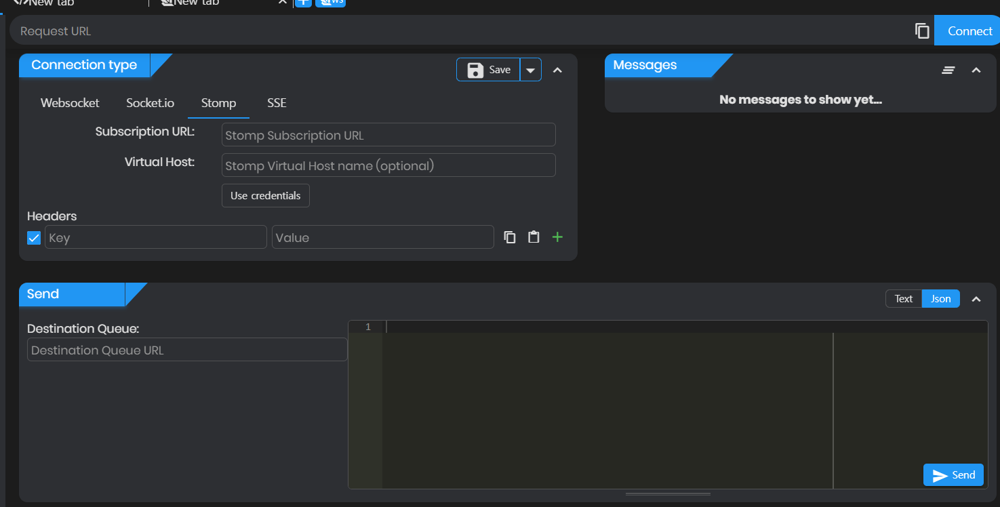

# 웹소켓을 활용해 실시간 채팅 구현하기 - Springboot

```
웹소켓을 활용해 실시간 채팅 구현하기 - Springboot
웹소켓을 활용해 실시간 채팅 구현하기 - React
```

## 웹소켓이란

**✔ WebSocket은 실시간 양방향 통신을 위한 프로토콜의 일종이다.**

WebSocket은 기본적으로 TCP 프로토콜을 사용하며, 핸드쉐이크 과정을 통해 연결을 수립한 후, **지속적인 연결**을 통해 양방향 통신이 가능하게 된다.

주로 실시간 채팅, 게임 등에 많이 쓰인다

## 웹소켓의 장점 및 특징 (vs HTTP)

✔ 웹소켓의 핵심 키워드는 **지속적인 연결**이다.

웹소켓의 장점과 특징은 HTTP와 비교했을 때 명확해진다.

일반적으로 사용되는 HTTP는 stateless, connectionless라는 특징으로 인해 실시간으로 양방향 통신을 맺고자할 때 WebSocket이 훨씬 유리하다.

웹소켓의 대표적인 예제인 실시간 채팅을 HTTP로 구현한다고 해보자.  
polling이란 기법을 활용해야되는데 요청에 대한 응답이 올 때까지 계속해서 요청을 보내는 방식이라 당연히 비용이 엄청 크다
```
HTTP에서 Polling으로 구현한 실시간 채팅

나 -> 서버: 안녕!

나 -> 서버: 대답 (요청1)
나 -> 서버: 대답 (요청2)
나 -> 서버: 대답 (요청3)
...
나 -> 서버: 대답 (요청N)

서버 -> 나: 안녕~ (대답 수신)
```
딱봐도 비효율적이다...

long polling이란 방법도 있는데 기본적으로 HTTP 자체가 실시간 통신을 위해 설계된 프로토콜은 아니기 때문에 웹소켓에 비할 바는 못된다.

### STOMP

✔ STOMP(Simple Text Oriented Messaging Protocol)는 간단한 텍스트 기반 메시징 프로토콜로 메세지의 형식 등을 정의하며 **sub/pub로 메세지의 송수신을 관리**한다.

주로 WebSocket에서 사용되는데 사실을 별개의 프로토콜이니 헷갈려선 안될 것이다.

## Spring 코드

Spring은 Stomp 서버로서 역할을 하게 된다

사실상 웹소켓 객체를 생성하고 연결을 맺는 건 프론트에서 하게 되기 때문에 백엔드 코드는 매우 단순하다.

sub/pub를 설정해주고, 컨트롤러에 웹소켓 통신 요청이 들어오면 설정해둔 주소로 메세지를 보내는 게 전부이다.

### WebSocketConfig.java

```java
@Configuration
@EnableWebSocketMessageBroker
public class WebSocketConfig implements WebSocketMessageBrokerConfigurer {

  @Override
  public void configureMessageBroker(MessageBrokerRegistry config){
    config.enableSimpleBroker("/sub"); // 구독 주소
    config.setApplicationDestinationPrefixes("/pub"); // 발행 주소
  }

  @Override
  public void registerStompEndpoints(StompEndpointRegistry registry) {
    registry.addEndpoint("/ws") // 웹소켓 주소
        .setAllowedOriginPatterns("*"); // 허용 도메인 
//        .withSockJS();
  }
}

```

✔ SockJS는 브라우저에서 웹소켓이 지원 안 될 경우 sockjs로 넘어가도록 하는 건데 프론트에서 추가적인 설정이 필요하고, sockjs 설정을 할 경우 아래 테스트가 안되므로 그냥 안 하는 것을 추천한다. 무엇보다 요즘은 대부분 브라우저가 웹소켓 지원이 된다.

### chatController.java

```java
  private final SimpMessageSendingOperations sendingOperations;
  
  @MessageMapping("/send")
  public void sendChat(@RequestBody ChatInsertRequestDto requestDto) throws ClassNotFoundException, NotFoundException {

    String writerName = userService.getWriterName(requestDto.getWriterId());

    chatService.insertChat(requestDto, writerName);

    sendingOperations.convertAndSend("/sub/chat/" + requestDto.getGameId() + requestDto.getChatRoomId(), requestDto.toEntity(writerName));
  }
```

✔ `@MessageMapping`은 `@GetMapping`이나 `@PostMapping`과 같은 역할을 한다. 요청이 들어왔을 때 매핑할 주소를 적어준다.
- 메세지 전송 요청이 들어온다는 건 발행 요청인데 config에서 설정한 발행 주소인 'pub'는 알아서 인식해주기 때문에 pub 뒤에 올 주소를 적어주면 된다
- 전체주소: `ws://{도메인:포트번호}/pub/{MessageMapping주소}`


✔ `simpMessageSendingOperation`을 주입 받아서 보낼 주소 (`sub/{하위 주소}`)와 보낼 내용을 인자로 넣어서 보내주면 끝

## 테스트해보기

웹소켓은 프론트 클라이언트가 있어야해서 테스트가 매우 어려운 편이다.

메세지큐를 구현해 검증하는 방법이 있지만 별도의 테스트 코드가 꼭 필요한 경우가 아니라면 어려워서 권장되지 않는다.

크롬 익스텐션 APIC를 이용하면 Stomp와 웹소켓을 테스트 할 수 있다.




