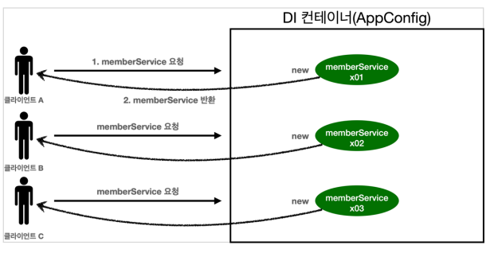

# Singleton Container

## 웹 애플리케이션 & 싱글톤

일반적은 웹 애플리케이션은 여러 고객이 동시에 요청을 한다!



### 스프링 없는 순수한 DI컨테이너

```java
public class SingletonTest {

    @Test
    @DisplayName("스프링 없는 순수한 DI컨테이너")
    void pureContainer() {
        AppConfig appConfig = new AppConfig();
        // 1. 조회: 호출 할 떄마다 객체 생성
        MemberService memberService1 = appConfig.memberService();

        // 2. 조회: 호출 할 떄마다 객체 생성
        MemberService memberService2 = appConfig.memberService();

        // 참조값이 다르다
//        System.out.println("memberService1 = " + memberService1);
//        System.out.println("memberService2 = " + memberService2);

        Assertions.assertThat(memberService1).isNotSameAs(memberService2);
    }
}
```

위와 같은 방식으로는 요청이 들어올 때마다 새로운 객체를 생성하게 된다 -> 메모리 낭비!

따라서 위와 같은 문제를 해결하기 위한 방식이 싱글톤 패턴!

**✔ 1개의 객체만 생성되고 공유하도록 설계**

## 싱글톤 패턴

✔ **싱글톤 패턴(Singleton Pattern): 클래스의 인스턴스가 딱 1개만 생성되는 것을 보장하는 디자인 패턴**

private 생성자를 이용해 외부에서 임의로 new 키워드를 사용해 두 개 이상의 객체 인스턴스가 생성되는 것을 방지한다

### 싱글톤 패턴을 적용한 코드

```java
package hello.core.singleton;

public class SingletonService {

    // 1. static 영역에 1개의 객체만을 생성
    private static final SingletonService instance = new SingletonService();

    // 2. 객체 인스턴스가 필요하면 해당 public static 메서드를 통해서만 조회 가능
    public static SingletonService getInstance() {
        return instance;
    }

    // 3. private 생성자
    private SingletonService() {
        
    }

    public void logic() {
        System.out.println("싱글톤 객체 로직 호출");
    }
}
```

1. static 영역에 한 개의 객체 instance만을 생성해서 올려둔다.
2. 해당 객체 인스턴스가 필요하면 오직 `getInstance()` 메서드를 통해서만 조회 가능(항상 같은 인스턴스 반환)
3. 생성자를 private으로 막아 외부에서 새로운 객체 생성 방지

### 싱글톤 패턴 테스트 코드

```java

@Test
@DisplayName("싱글톤 패턴을 적용한 객체 사용")
void singletonServiceTest() {

    SingletonService singletonService1 = SingletonService.getInstance();
    SingletonService singletonService2 = SingletonService.getInstance();

    //참조값이 같은 것을 확인
    System.out.println("singletonService1 = " + singletonService1);
    System.out.println("singletonService2 = " + singletonService2);

    // same: 객체 비교 (==)
    // equal: equals 메서드
    Assertions.assertThat(singletonService1).isSameAs(singletonService2);
}
```


같은 객체 인스턴스가 반환된다.

### 싱글톤 패턴의 단점

싱글톤 패턴을 구현하는 코드 자체가 많다

클라이언트가 구체 클래스에 의존하게 된다 (DIP, OCP 위반)

테스트하기가 어려움

내부 속성 변경 or 초기화 어려움

**유연성이 떨어진다**

## 싱글톤 컨테이너

스프링 컨테이너를 사용해서 싱글톤 패턴의 문제점을 해결하면서 싱글톤 패턴을 적용할 수 있다.

### 싱글톤 컨테이너

**스프링 컨테이너는 싱글톤 패턴을 적용하지 않아도 객체 인스턴스를 알아서 싱글톤으로 관리한다**

싱글톤 레지스트리: 싱글톤 객체를 생성하고 관리하는 기능

싱글톤 컨테이너를 사용하면
- 싱글톤 패턴을 위한 코드를 따로 작성하지 않아도 된다
- DIP, OCP, 테스트, private 생성자 등 싱글톤 패턴의 문제를 해결할 수 있따.

### 스프링 컨테이너를 사용한 테스트 코드

```java
    @Test
    @DisplayName("스프링 컨테이너와 싱글톤")
    void springContainter() {

        ApplicationContext ac = new AnnotationConfigApplicationContext(AppConfig.class);

        // 1. 조회: 호출 할 떄마다 객체 생성
        MemberService memberService1 = ac.getBean("memberService", MemberService.class);

        // 2. 조회: 호출 할 떄마다 객체 생성
        MemberService memberService2 = ac.getBean("memberService", MemberService.class);

        // 참조값이 같다
//        System.out.println("memberService1 = " + memberService1);
//        System.out.println("memberService2 = " + memberService2);

        Assertions.assertThat(memberService1).isSameAs(memberService2);
    }
```

### 싱글톤 컨테이너 적용 후


스프링 컨테이너를 활용하여 하나의 객체를 공유해서 효율적으로 재사용 할 수 있다.

- 참고: 스프링은 싱글톤 방식 외의 방식으로도 빈을 등록할 수 있다 (빈스코프)

## 싱글톤 방식의 주의점

✔ 싱글톤 방식은 여러 클라이언트가 하나의 동일한 객체 인스턴스를 공유하기 때문에 상태를 유지(stateful)하게 설계 하면 안된다.

✔ **싱글톤은 무상태(Stateless)로 설계해야 한다**
- 특정 클라이언트에 의존적인 필드 x
- 특정 클라이언트가 값을 변경할 수 있는 필드 x
- (가급적) 읽기만 가능
- 필드 대신 자바에서 공유되지 않는 지역변수, 파라미터, ThreaLocal 등 사용

### Stateful 싱글톤의 문제점

```java
package hello.core.singleton;

public class StatefulService {

    private int price; // 상태를 유지(Stateful)하는 필드

    public void order (String name, int price) {
        System.out.println("name = " + name + " price = " + price);
        this.price = price; // 여기서 문제가 발생한다.
    }

    public int getPrice() {
        return price;
    }
}

```

```java
class StatefulServiceTest {

    @Test
    void statefulServiceSingleton() {
        ApplicationContext ac = new AnnotationConfigApplicationContext(TestConfig.class);
        StatefulService statefulService1 = ac.getBean(StatefulService.class);
        StatefulService statefulService2 = ac.getBean(StatefulService.class);

        // Thread A: A사용자 10000원 주문
        statefulService1.order("userA", 10000);
        // Thread B: B사용자 20000원 주문
        statefulService2.order("userB", 20000);

        // Thread A: 사용자 A 주문 금액 조회
        int price = statefulService1.getPrice();
        System.out.println("price = " + price);

    }

    static class TestConfig {

        @Bean
        public StatefulService statefulService() {
            return new StatefulService();
        }
    }

}
```


`price` 필드가 공유되어 값이 덮어씌워진다!

## `@Configuration`과 싱글톤

```java
@Configuration
public class AppConfig {

    @Bean
    public MemberService memberService() {
        return new MemberServiceImpl(memberRepository());
    }

    @Bean
    public OrderService orderService() {
        return new OrderServiceImpl(memberRepository(), new FixDiscountPolicy());
    }

    @Bean
    public MemberRepository memberRepository() {
        return new MemoryMemberRepository();
    }
    
    @Bean
    public DiscountPolicy discountPolicy() {
        return new RateDiscountPolicy();
    }
}

```

`memberService -> memberRepository()`  
`orderService -> memberRepository()`

위와 같은 코드에서 MemoryMemborRepository는 몇 번 호출될 것인가?


```java
    @Test
    void configurationTest() {
        ApplicationContext ac = new AnnotationConfigApplicationContext(AppConfig.class);
        MemberServiceImpl memberService = ac.getBean("memberService", MemberServiceImpl.class);
        OrderServiceImpl orderService = ac.getBean("orderService", OrderServiceImpl.class);
        MemberRepository memberRepository = ac.getBean("memberRepository", MemberRepository.class);

        //모두 같은 인스턴스를 참고하고 있다.
        System.out.println("memberService -> memberRepository = " + memberService.getMemberRepository());
        System.out.println("orderService -> memberRepository = " + orderService.getMemberRepository());
        System.out.println("memberRepository = " + memberRepository);

        //모두 같은 인스턴스를 참고하고 있다.

        assertThat(memberService.getMemberRepository()).isSameAs(memberRepository);

        assertThat(orderService.getMemberRepository()).isSameAs(memberRepository);
    }
```

```text
// 테스트 결과

memberService -> memberRepository = hello.core.member.MemoryMemberRepository@56e8b606
orderService -> memberRepository = hello.core.member.MemoryMemberRepository@56e8b606
memberRepository = hello.core.member.MemoryMemberRepository@56e8b606
```
2번일 것 같지만 실제로 조회해보면 1번만 호출된다(동일한 객체를 참조)


## `@Configuration`과 바이트코드 조작의 마법

위와 같은 상황에서 스프링은 클래스의 바이트코드를 조작하는 라이브러리를 사용해 한 번만 호출되도록 한다

```java
@Test
void configurationDeep() {
    ApplicationContext ac = new AnnotationConfigApplicationContext(AppConfig.class);
    
    //AppConfig도 스프링 빈으로 등록된다.
    AppConfig bean = ac.getBean(AppConfig.class);

    System.out.println("bean = " + bean.getClass());
    //출력: bean = class hello.core.AppConfig$$EnhancerBySpringCGLIB$$bd479d70
}
```

`AppConfig$$EnhancerBySpringCGLIB$$bd479d70`???


스프링이 CGLIB라는 바이트코드 조작 라이브러리를 사용해서 `AppConfig`클래스를 상속받은 임의의 다른 클래스를 만들고, 그 다른 클래스를 스프링 빈으로 등록한다

@Bean만 사용해도 스프링 빈으로 등록되지만, 싱글톤을 보장하지 않는다  


✔ **스프링 설정 정보는 항상 `@Configuration` 사용**